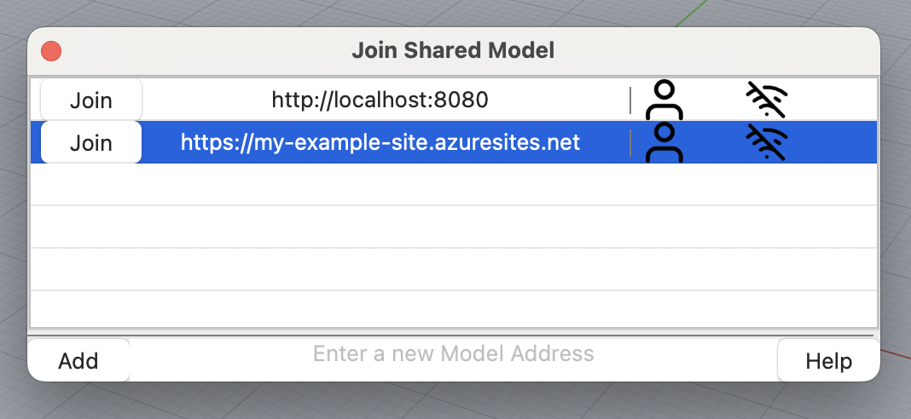
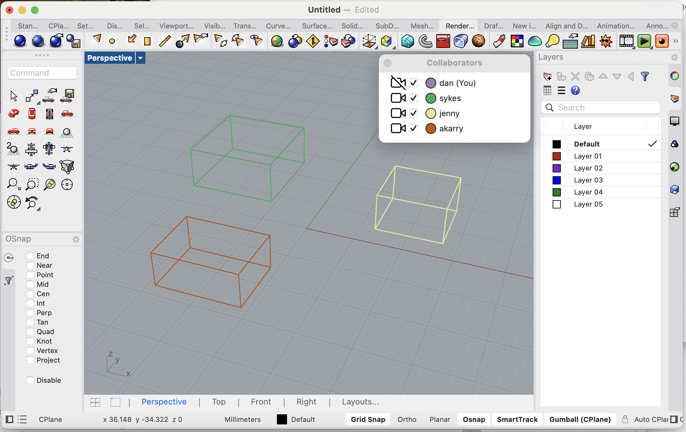
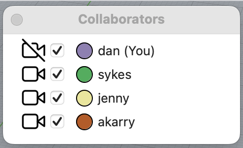

Let's start simple and get a basic overview of Crash. We'll go into more detail later. If you get stuck in this quick guide, you can always search for the topic you are lost on.

## Join a Shared Model

Crash lets you access models shared by any number of collaborators.
To join, use the `JoinSharedModel` command, enter a URL and click 'Join'

We will now see a Crash Model, full of users collaborating on different parts of the model.

## The Collaborators Panel

The collaborators panel shows all of the users currently in the model, you will be listed at the top.

## Create a piece of Geometry

> Create a box

As soon as you finish creating the box, Crash will send this to the server, and relay it to every other user listed in the Collaborators panel. Users will see the box in the same colour next to your name. Every users colour is consistent between every collaborator.

## Release your work

Releasing sends all your temporary (work in progress) geometry to other collaborators.
Use the `Release` command

## Troubleshooting

### Collaborators do not see my Geometry

- Are you currently in a shared model?
- Type JoinSharedModel
- If Crash tells you that you are already in a model then post an issue on discourse

### I see a red box around my geometry

The geometry cannot be sent for one or more reasons. Likely issues with the server are the reason, or the geometry is too large.

### Something else happened

This is unsual, please post a question on [discourse](https://discourse.mcneel.com/c/plug-ins/multi-user/163/)
