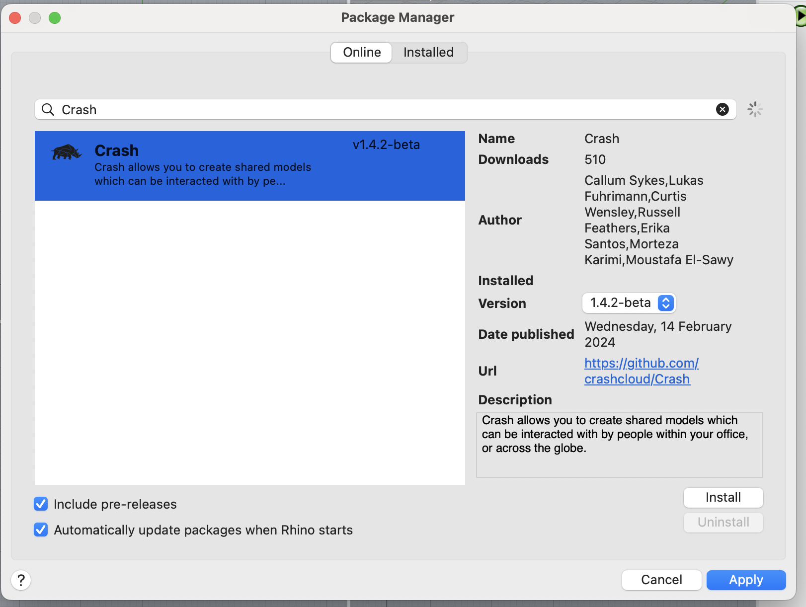

The simplest way to use Crash is to install the plugin and join someone elses shared model.

Crash is available on Rhino 7 on Windows, and Rhino 8 for both Windows and Mac.
To install Crash for Rhino, run the `PackageManager` command and search for Crash.
If you cannot see Crash, try updating your Rhino Version.

