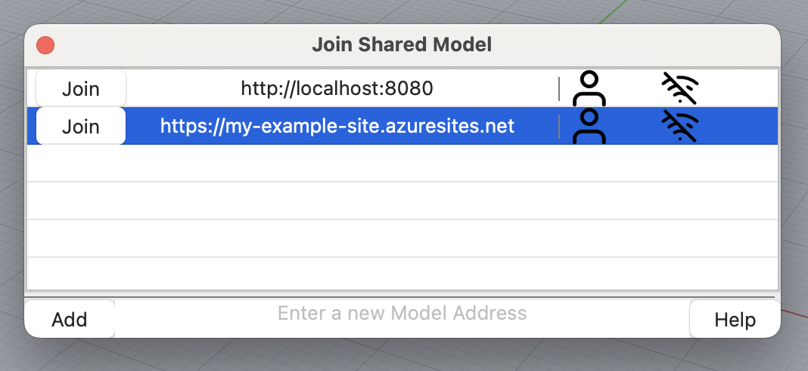
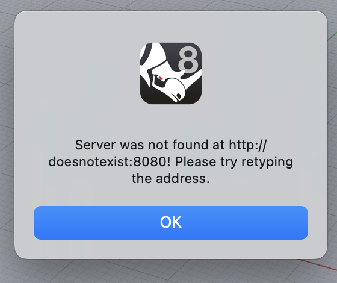
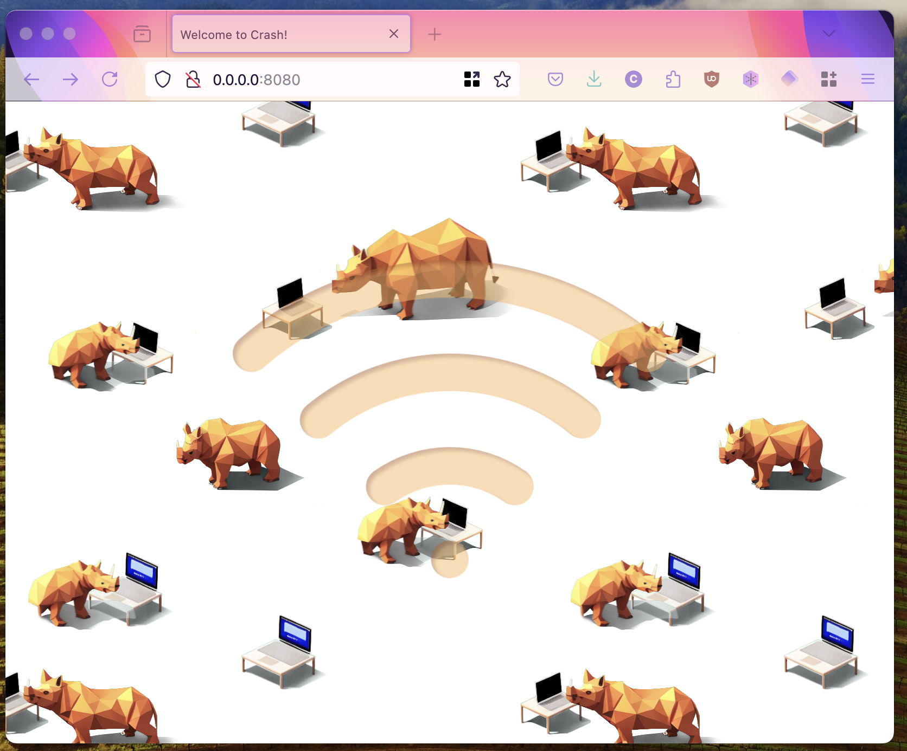

Joining a shared model and starting to collaborate couldn't be easier.

Run the `JoinSharedModel` command.

To add a model to the list

{}

### Start

Click in the "Enter a new Model Address" text area

### Input

Write or paste the URL or IP Address of the model you wish to join

### Add

Click Add, to add it to the list.
Crash will remember this model for later

### Select

Select the newly added row

### Join

Click the Join button on the left of your address

{}

Crash will now attempt to join the shared model.


Do not join URLs or IP addresses you are not familiar with.
And do not give our your own IP Address to people you are unfamiliar with.


## Removing a Model

A model can be removed from the list by Right Clicking, and selecting "Remove".

## Troubleshooting

### The Command does not appear

If the command does not appear, make sure you have installed the latest version of Crash correctly.

### I got an error message

If the error message is similar to below, and the Join Shared Model window re-appeared, then there is an issue with your url. Ensure you typed it correctly, and that it exists.

You can put any IP Address or URL into your web browser and you should see a friendly Crash splash-screen if the server exists. If you see nothing, the address is wrong, or the server is not available.

### Something else happened

This is unsual, please post a question on [discourse](https://discourse.mcneel.com/c/plug-ins/multi-user/163/)
